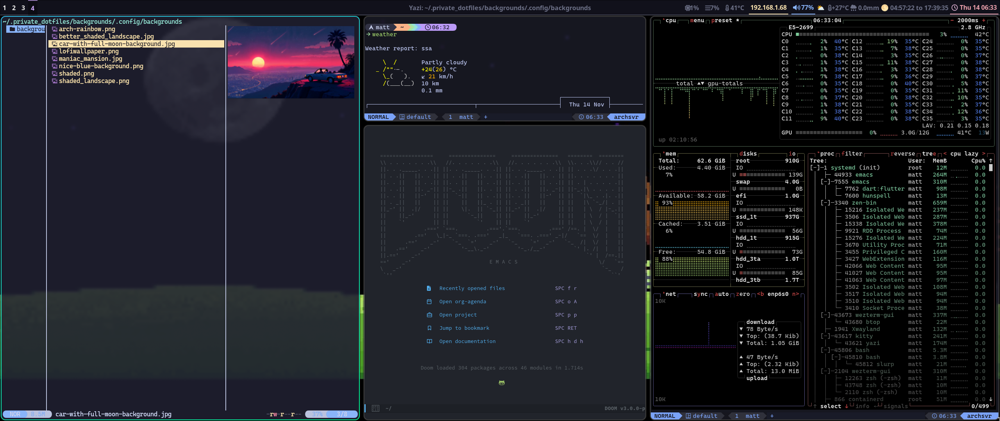

# dotfiles

Thanks to https://github.com/prasanthrangan/hyprdots, so beautiful

Arch Linux & Mac dotfiles

 ``` sh
 git clone git@github.com:mberrueta/dotfiles.git ~/.dotfiles
 ```
 
## Arch



Take a look to the packages to install in folder [arch]

``` sh
sudo pacman -Sy --needed $(sed 's/#.*//' arch/pacman_manually_installed_packages.config | xargs)
# --needed         avoid re installs
# --clean          remove old packages from cache

git clone https://aur.archlinux.org/yay.git && cd yay
makepkg -si

yay -Sy --needed $(sed 's/#.*//' arch/yay_manually_installed_packages.config | xargs)
```

In case of NVIDIA drivers needed 
`yay -S nvidia-open nvidia-settings nvidia-utils nvidia-container-toolkit `

Now with `stow` we will configure the tools

``` sh
directories=("alacritty" "hyprland" "hyprlock" "hyde" "hyprmocha" "hyprpaper" "kitty" "zsh" "wezterm" "waybar" "wofi" "starship" "dunst")

for dir in "${directories[@]}"; do
  stow "$dir"
done
```

Optional: Doom Emacs

``` sh
git clone --depth 1 https://github.com/doomemacs/doomemacs ~/.config/emacs
~/.config/emacs/bin/doom install
stow doom
```
